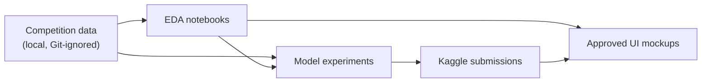
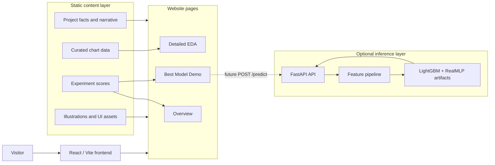
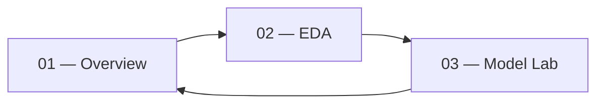
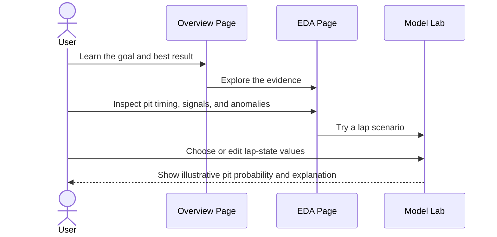
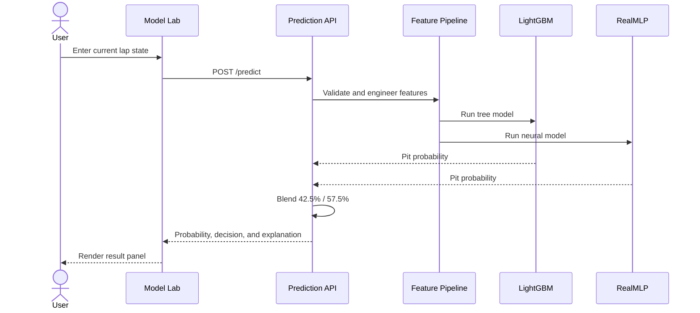
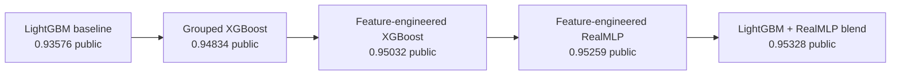

# PitWall AI — Site Architecture and Workflow

This document defines the proposed website structure for the F1 pit-stop prediction project. It translates the current notebooks, experiment results, and approved UI mockups into an implementation-ready product plan.

The first implementation can be a static, data-backed showcase. Live model inference can be added later without changing the page structure.

## 1. Product Goal

PitWall AI explains and demonstrates a machine-learning system that predicts whether a Formula 1 driver will pit on the next lap.

The website should:

- introduce the prediction problem and project workflow
- turn the detailed EDA notebook into a clear visual story
- explain the modeling experiments and best-performing blend
- provide an illustrative model demo
- later support predictions from a real inference API

## 2. Current and Target Architecture

### Current project state



### Proposed website



Solid arrows represent the initial static site. The dotted path is the later live-model extension.

## 3. Information Architecture



The same persistent left navigation appears on every page:

```text
PitWall AI
|-- Overview
|-- EDA
`-- Model Lab
```

Recommended routes:

```text
/               Overview
/eda            Detailed EDA
/model-lab      Best Model Demo
```

## 4. Page Specifications

### 4.1 Overview

Reference mockup: [`mockups/01-overview.png`](mockups/01-overview.png)

Purpose: explain the project in under a minute and lead visitors into the analysis or demo.

Content order:

1. Hero
   - project name: **PitWall AI**
   - headline: **Predict the next pit stop**
   - short explanation of lap-level strategy prediction
2. Project goal
   - predict `PitNextLap`
   - 439,140 training observations
   - binary classification
   - ROC AUC evaluation
3. Approach
   - explore
   - engineer
   - validate
   - blend
4. Best model
   - LightGBM + RealMLP blend
   - 0.953876 OOF ROC AUC
   - 0.95369 private ROC AUC
   - 0.95328 public ROC AUC
   - 42.5% LightGBM and 57.5% RealMLP
5. Workflow
   - lap state
   - engineered features
   - out-of-fold models
   - weighted blend
   - pit probability
6. Calls to action
   - explore the EDA
   - open the model demo

### 4.2 Detailed EDA

Reference mockup: [`mockups/02-eda.png`](mockups/02-eda.png)

Purpose: convert the detailed EDA notebook into a scan-friendly, evidence-led report.

Recommended sections:

| Section | Visualization | Main message |
|---|---|---|
| Dataset snapshot | Metric cards | 439,140 rows, 16 input features, binary target |
| Target balance | Donut or stacked bar | Approximately 80% stay out and 20% pit |
| Pit timing | Histogram / density chart | Most stops occur with 10–20 laps of tyre life |
| Feature signals | Ranked horizontal bars | `TyreLife` and `LapNumber` are strongest raw signals |
| Feature redundancy | Correlation callout | `LapNumber` and `RaceProgress` correlate at about 0.96 |
| Compound behavior | Horizontal bars | HARD has the highest observed pit rate at 32.8% |
| Year behavior | Time-series warning card | 2023 has an anomalous pit rate near 0.96% |
| Train/test drift | Comparison plot | Numeric distributions are broadly aligned |
| Race variability | Ranked circuit comparison | Strategy signal differs substantially by race |
| Modeling actions | Prioritized checklist | Clean sessions, isolate anomalies, engineer interactions |

Key notebook findings to preserve:

- do not assume synthetic data follows real-world F1 strategy
- remove Pre-Season Testing rows for race-strategy modeling
- investigate or isolate the anomalous 2023 rows
- use grouped, year-aware, or otherwise leakage-conscious validation
- build rolling and interaction features instead of trusting raw lap-time delta
- preserve race identity because circuits have different pit tendencies

The EDA page should reveal the story progressively instead of reproducing the notebook cell by cell.

### 4.3 Best Model Demo

Reference mockup: [`mockups/03-model-demo.png`](mockups/03-model-demo.png)

Purpose: let visitors understand how a lap state becomes a pit probability.

Initial static-demo inputs:

- driver
- race
- year
- lap number
- stint
- tyre compound
- tyre life
- track position
- lap-time delta
- cumulative degradation
- race progress
- position change

Initial static-demo output:

- pit / stay-out decision
- illustrative probability
- confidence label
- recommended radio-style call
- model contribution split
- two or three plain-language reasons
- visible note that the values are illustrative

The first version should use controlled presets rather than pretending to run the trained model. Example scenarios can include:

```text
Early stint / fresh tyre      -> low pit probability
Common pit window             -> elevated pit probability
Late race / old tyre          -> high pit probability
2023 anomaly example          -> data-quality warning
```

When live inference is added, the same screen can send the selected lap state to the backend.

## 5. User Flow



Future live-inference flow:



## 6. Component Architecture

```text
App
|-- AppShell
|   |-- SideNavigation
|   |-- RouteTransition
|   `-- PageCanvas
|-- OverviewPage
|   |-- Hero
|   |-- ProjectGoalCard
|   |-- ApproachSteps
|   |-- BestModelCard
|   `-- WorkflowStrip
|-- EdaPage
|   |-- EdaHeader
|   |-- TargetBalanceChart
|   |-- PitWindowChart
|   |-- CompoundRateChart
|   |-- SignalRankingChart
|   |-- YearAnomalyCard
|   |-- DriftComparison
|   `-- KeyTakeaways
`-- ModelLabPage
    |-- LapStateForm
    |-- CompoundSelector
    |-- PredictionGauge
    |-- RecommendationCard
    |-- ModelContribution
    |-- PredictionReasons
    `-- DemoDisclaimer
```

Shared primitives:

```text
Card
Metric
Badge
SectionLabel
IconButton
ChartTooltip
ProgressBar
TyreCompoundDot
PageIllustration
```

## 7. Content and Data Layer

The website should not parse notebooks in the browser. Notebook conclusions should be distilled into small, version-controlled data files.

Proposed structure:

```text
site/
|-- src/
|   |-- components/
|   |-- pages/
|   |-- data/
|   |   |-- project-summary.json
|   |   |-- eda-findings.json
|   |   |-- experiment-scores.json
|   |   `-- demo-scenarios.json
|   |-- assets/
|   |-- styles/
|   `-- App.jsx
|-- public/
|-- package.json
`-- vite.config.js
```

Suggested data ownership:

| File | Source |
|---|---|
| `project-summary.json` | Root project README |
| `eda-findings.json` | Detailed EDA notebook and report |
| `experiment-scores.json` | Experiment table and submissions |
| `demo-scenarios.json` | Hand-authored illustrative examples |

This keeps the UI deterministic, makes statistics easy to audit, and avoids copying numbers into multiple components.

## 8. Model Story

The site should present modeling as an evolution rather than a list of disconnected notebooks.



Best saved submission:

```text
submission_blend_lgbm_realmlp - lb - 0.95328.csv
```

Blend formula:

```text
pit_probability =
    0.425 * lightgbm_probability
  + 0.575 * realmlp_probability
```

## 9. Proposed Prediction API

The API is not required for the first static build.

Suggested endpoints:

```text
GET  /health
GET  /metadata
GET  /demo-scenarios
POST /predict
POST /predict/batch
```

Example request:

```json
{
  "driver": "VER",
  "compound": "HARD",
  "race": "Monaco Grand Prix",
  "year": 2025,
  "lap_number": 31,
  "stint": 2,
  "tyre_life": 18,
  "position": 3,
  "lap_time": 73.42,
  "lap_time_delta": 0.84,
  "cumulative_degradation": -2.17,
  "race_progress": 0.397,
  "position_change": 0
}
```

Example response shape:

```json
{
  "prediction": "pit",
  "pit_probability": 0.78,
  "threshold": 0.5,
  "model": "lgbm_realmlp_blend",
  "model_weights": {
    "lightgbm": 0.425,
    "realmlp": 0.575
  },
  "reasons": [
    "Tyre age is inside a common pit window.",
    "Race and stint context increase the estimated probability."
  ]
}
```

The example probability is illustrative until serialized model artifacts and the exact training feature pipeline are available.

## 10. Visual System

The approved mockups establish the following direction:

| Token | Usage |
|---|---|
| Midnight navy `#14213D` | Navigation, headings, borders |
| Coral red | Pit action, alerts, primary interaction |
| Marigold yellow | Supporting highlights |
| Pale lavender | Model and analysis accents |
| Mint | Positive validation and stable-drift states |
| Warm ivory | Main background |

Design principles:

- editorial storytelling rather than a generic admin dashboard
- rounded cards with crisp navy outlines and soft shadows
- generous whitespace and large, legible metrics
- subtle circuit maps, telemetry lines, tyre rings, and watercolor texture
- racing references without real team branding
- coral reserved for decisions, risk, and pit-related emphasis
- motion should clarify transitions, not simulate a noisy race broadcast

## 11. Responsive Behavior

### Desktop

- persistent left navigation
- two- or three-column card layouts
- charts displayed at full analytical detail
- large hero illustration and prediction gauge

### Tablet

- compact icon navigation
- two-column grids collapse selectively
- EDA charts retain labels and tooltips

### Mobile

- navigation becomes a bottom bar or top drawer
- all cards stack into one column
- charts use horizontal scrolling only when labels cannot be simplified
- the model form appears before the prediction result
- decorative illustrations reduce in size or move behind content

## 12. Accessibility

- meet WCAG AA contrast for text and controls
- never encode compound, warning, or result state by color alone
- provide text summaries for every chart
- support keyboard navigation and visible focus states
- respect `prefers-reduced-motion`
- use semantic headings and landmark regions
- announce prediction updates through an ARIA live region
- label the demo explicitly as illustrative until live inference exists

## 13. Implementation Phases

### Phase 1 — Static showcase

- create the application shell and routes
- reproduce the three approved mockups
- add responsive behavior
- render charts from curated local JSON
- implement preset demo scenarios
- add accessibility and visual-regression checks

### Phase 2 — Interactive storytelling

- add chart tooltips and filters
- animate workflow and page transitions
- add experiment comparison controls
- support editable demo fields with deterministic mock responses

### Phase 3 — Live inference

- export model artifacts and preprocessing metadata
- reproduce the exact feature pipeline outside the notebook
- build and test the prediction API
- replace mock responses with API calls
- add input validation, errors, and loading states

### Phase 4 — Validation and deployment

- compare API predictions with notebook predictions
- run responsive and cross-browser testing
- optimize images and chart bundles
- deploy frontend and backend
- document model and data limitations

## 14. Source Material

```text
Predicting-F1-pit-stops/
|-- README.md
|-- Detailed EDA report/
|   |-- README.md
|   `-- lap-by-lap-predicting-pit-stops-detailed-eda.ipynb
|-- Experiments/
|   |-- lap-by-lap-s5e6-detailed-eda-baseline-lgbm.ipynb
|   |-- pitstop_pred_xgb_groupkfold_oof.ipynb
|   |-- xgb_stratified_fe.ipynb
|   |-- realmlp_stkf_fe.ipynb
|   `-- oof_blend_mlp_X_lgbm.ipynb
`-- Submissions/

mockups/
|-- 01-overview.png
|-- 02-eda.png
`-- 03-model-demo.png
```

## 15. Architecture Decisions

- The initial site is frontend-only because the user experience can be validated without model-serving infrastructure.
- Curated JSON is the source of truth for website statistics; notebooks remain the analytical source.
- The EDA is rewritten as a narrative web report rather than embedded as a notebook.
- The demo must disclose illustrative values until it calls a verified inference pipeline.
- The final live model must reuse the exact feature order, encoders, and transformations from training.
- Model explanations should describe influential input context without claiming causal reasoning.
- Synthetic competition patterns must not be presented as universal real-world Formula 1 strategy.
